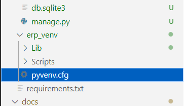

# P01 安装环境

## 安装 Python

　　‍

## 配置虚拟环境

### 步骤

1. 创建虚拟环境

    `python -m venv erp_venv`

    > erp_venv 为虚拟环境的名字
    >

    Python 虚拟环境，并将其安装在你当前所在目录下的 `erp_venv` 文件夹中。虚拟环境可以帮助你隔离不同的项目的依赖库，这样可以避免项目间的库版本冲突。
2. 启动虚拟环境

    进入虚拟环境目录 `cd`

    > `.\Scripts\activate`
    >
3. 退出虚拟环境

    `deactivate`
4. 安装 Django

    `pip install django`  
    Django 是一个 Python web 框架，提供许多功能，如 ORM、认证、表单、模板等，它可以帮助你更快、更轻松地开发 web 应用程序。
5. 安装 DRF

    `pip install djangorestframework`  
    DRF 是一个基于 Django 的强大而灵活的 RESTful 框架，它提供了许多工具和库，可帮助你快速开发基于 RESTful API 的 web 应用程序。
6. 安装 Django-Filter

    `pip install django-filter`

    介绍：[Integration with DRF — django-filter 23.2 documentation](https://django-filter.readthedocs.io/en/stable/guide/rest_framework.html#drf-integration)

    Django-Filter 是一个基于 Django 的库，它提供了一种简单、灵活的方式来过滤 Django 模型的查询集。Django-Filter 的 API 允许开发者使用简单的查询表达式，构建和应用复杂的过滤器，从而在查询集中选择和排除数据。

    Django-Filter 通过与 DRF Spectacular 的集成，支持 OpenAPI 规范表述的数据过滤和查询，提供了更加优雅的 API 规范方案。
7. 安装 Django Spectacular

    `pip install drf_spectacular`  
    介绍：DRF Spectacular 是 DRF 的 OpenAPI 规范工具。它可以自动构建和生成 OpenAPI 规范文档，并提供方便的 API 测试工具，使你能够更加轻松地创建、测试和维护 RESTful API。同时，它也支持集成 Django Filter，允许你通过 URL 参数过滤查询数据。

### **练习**：

1. 在虚拟环境中，安装 debug_toolbar 库
2. 在虚拟环境中，安装 django_extensions 库

　　**答案：**

1. 在虚拟环境中，安装 debug_toolbar 库

    `pip install django-debug-toolbar`
2. 在虚拟环境中，安装 django_extensions 库

    `pip install django_extensions`

　　‍

　　‍

### 报错解决

  - 若打开虚拟环境使用`python manage.py makemigrations`显示`No Python at C:\Users\78523\AppData\Local\Programs\Python\Python39\python.exe'`  
  
      

  - 可使用requirements.txt选择你本地的python来一键创建虚拟环境 

      

  - 之后将其中的`.venv\pyvenv.cfg`复制到`code\erp_venv\pyvenv.cfg`中即可解决。

    

　　‍
